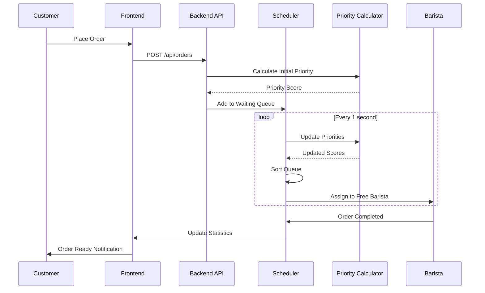

# ☕ Coffee Shop Order Management System

<div align="center">


**An intelligent, priority-based order scheduling system for high-volume coffee shop operations**

[Features](#-features) • [Architecture](#-architecture) • [Installation](#-installation) • [API Docs](#-api-documentation) • [Simulation](#-simulation-engine)

</div>

---

## 📋 Table of Contents

- [Overview](#-overview)
- [Problem Statement](#-problem-statement)
- [Key Features](#-features)
- [System Architecture](#-architecture)
- [Technology Stack](#-technology-stack)
- [Installation & Setup](#-installation--setup)
- [API Documentation](#-api-documentation)
- [Priority Algorithm](#-priority-scoring-algorithm)
- [Simulation Engine](#-simulation-engine)
- [Performance Metrics](#-performance-metrics)
- [Project Structure](#-project-structure)
- [Future Enhancements](#-future-enhancements)
- [Contributing](#-contributing)

---

## 🎯 Overview

The **Coffee Shop Order Management System** is a full-stack application designed to optimize order processing in high-traffic coffee shops. It uses an intelligent **multi-factor priority scheduling algorithm** to minimize customer wait times while ensuring fairness and meeting SLA requirements.

### Real-World Problem Solved

Coffee shops face challenges during peak hours:
- ⏱️ Long customer wait times leading to dissatisfaction
- ⚖️ Unfair queue management (FIFO doesn't account for order complexity)
- 🚨 SLA violations for time-sensitive orders
- 👑 No differentiation for loyal customers
- 📊 Lack of data-driven insights for operational efficiency

This system addresses these issues with **dynamic priority scoring**, **real-time order tracking**, and **comprehensive analytics**.

---

## 🎯 Problem Statement

### Business Requirements

**Scenario**: A busy coffee shop serves 200-300 customers during morning rush (7 AM - 10 AM) with 3 baristas.

**Constraints**:
- Maximum customer wait time: **10 minutes** (SLA)
- Varying drink preparation times (1-6 minutes)
- Mixed order complexity
- Loyalty program members deserve priority
- Fair treatment of all customers

**Objective**: Design a scheduling system that:
1. Minimizes average wait time
2. Prevents SLA violations (>10 min wait)
3. Balances workload across 3 baristas
4. Prioritizes urgent and loyal customer orders
5. Provides real-time visibility into queue status

---

## ✨ Features

### Core Functionality

| Feature | Description |
|---------|-------------|
| 🧮 **Dynamic Priority Scoring** | Multi-factor algorithm considering wait time, complexity, loyalty, and urgency |
| ⚡ **Real-Time Queue Management** | Live order tracking with ETA calculations and status updates |
| 👨‍🍳 **Smart Barista Scheduling** | Automated assignment based on availability and workload balancing |
| 🚨 **SLA Monitoring & Alerts** | Proactive warnings at 9 minutes, critical alerts at 10 minutes |
| 📊 **Performance Analytics** | Average wait time, max wait, orders served, SLA violations tracking |
| 🧪 **Advanced Simulation Engine** | 10 test scenarios with 2000+ orders for validation |
| 📈 **Historical Data Export** | CSV exports for analysis and reporting |
| 🐳 **Containerized Deployment** | Docker & Docker Compose for easy setup |

### Priority Factors

```
Priority Score = Wait Time (40%) + Order Complexity (25%) + Urgency (25%) + Loyalty (10%)
```

- **Wait Time**: Linear increase up to 10 minutes
- **Complexity**: Inverse scoring (simpler orders get higher priority for throughput)
- **Urgency**: Emergency boost after 8 minutes (+50 points)
- **Loyalty**: Gold members receive 10% bonus

---

## 🏗️ Architecture

### System Design

```
┌─────────────────────────────────────────────────────────────┐
│                      Frontend (React)                        │
│  ┌─────────────┐  ┌──────────────┐  ┌──────────────┐      │
│  │ Order Entry │  │ Queue Display│  │ Analytics    │      │
│  │   Widget    │  │  Dashboard   │  │  Dashboard   │      │
│  └─────────────┘  └──────────────┘  └──────────────┘      │
└────────────────────────┬────────────────────────────────────┘
                         │ REST API
┌────────────────────────▼────────────────────────────────────┐
│                  Spring Boot Backend                         │
│  ┌──────────────────────────────────────────────────────┐  │
│  │              BaristaScheduler Service                 │  │
│  │  • Priority Queue Management                          │  │
│  │  • Scheduled Task Runner (1s interval)                │  │
│  │  • SLA Alert System                                   │  │
│  └──────────────────────────────────────────────────────┘  │
│  ┌──────────────────────────────────────────────────────┐  │
│  │           PriorityCalculator Service                  │  │
│  │  • Multi-factor scoring algorithm                     │  │
│  │  • Dynamic priority updates                           │  │
│  └──────────────────────────────────────────────────────┘  │
│  ┌──────────────────────────────────────────────────────┐  │
│  │            SimulationService                          │  │
│  │  • Discrete event simulation                          │  │
│  │  • 10 test scenarios (2000+ orders)                   │  │
│  │  • CSV data generation                                │  │
│  └──────────────────────────────────────────────────────┘  │
└─────────────────────────────────────────────────────────────┘
                         │
                         ▼
              ┌──────────────────┐
              │  In-Memory Store │
              │  (ConcurrentQueue)│
              └──────────────────┘
```

### Data Flow



---

## 🛠️ Technology Stack

### Backend
- **Framework**: Spring Boot 3.2.0
- **Language**: Java 17
- **Build Tool**: Maven
- **Scheduling**: Spring `@Scheduled` (1000ms fixed rate)
- **Data Structures**: `ConcurrentLinkedQueue`, `PriorityQueue`
- **Utilities**: Lombok, Java Time API

### Frontend
- **Framework**: React 18
- **State Management**: React Hooks (useState, useEffect)
- **HTTP Client**: Axios
- **UI Components**: Custom components with responsive design
- **Real-time Updates**: Polling (1s interval)

### DevOps
- **Containerization**: Docker, Docker Compose
- **Version Control**: Git
- **IDE**: IntelliJ IDEA (backend), VS Code (frontend)

### Data Export
- **Format**: CSV
- **Auto-generated**: Test inputs and simulation results

---

## 📦 Installation & Setup

### Prerequisites

```bash
# Required software
- Java 17+
- Node.js 18+
- Maven 3.8+
- Docker & Docker Compose (optional)
```

### Option 1: Docker Compose (Recommended)

```bash
# Clone the repository
git clone https://github.com/yourusername/coffee-shop-system.git
cd coffee-shop-system

# Start all services
docker-compose up -d

# Access the application
Frontend: http://localhost:5173
Backend API: http://localhost:8080
```

### Option 2: Manual Setup

#### Backend

```bash
cd backend

# Build the project
mvn clean install

# Run the application
mvn spring-boot:run

# Backend starts on http://localhost:8080
```

#### Frontend

```bash
cd frontend

# Install dependencies
npm install

# Start development server
npm run dev

# Frontend starts on http://localhost:5173
```

---

## 📡 API Documentation

### Endpoints

#### 1. Place Order
```http
POST /api/orders
Content-Type: application/json

{
  "customerName": "John Doe",
  "drinks": ["ESPRESSO", "LATTE"],
  "isLoyal": true
}
```

**Response**:
```json
{
  "id": "uuid-string",
  "customerName": "John Doe",
  "drinks": ["ESPRESSO", "LATTE"],
  "arrivalTime": "2025-02-09T08:30:00",
  "status": "WAITING",
  "priorityScore": 35.5,
  "priorityReason": "👑 Gold Member Priority",
  "etaSeconds": 180,
  "isLoyal": true
}
```

#### 2. Get Queue Status
```http
GET /api/queue
```

**Response**: Array of Order objects sorted by priority (highest first)

#### 3. Get Barista Status
```http
GET /api/baristas
```

**Response**:
```json
[
  {
    "id": "Barista 1",
    "isBusy": true,
    "currentOrder": { /* Order object */ },
    "busyUntilEpochMillis": 1707468300000
  }
]
```

#### 4. Get Performance Statistics
```http
GET /api/stats
```

**Response**:
```json
{
  "avgWaitTime": "4.5 min",
  "ordersServed": 87,
  "maxWaitTime": "8.2 min",
  "slaViolations": 2
}
```

#### 5. Run Simulation
```http
POST /api/simulation/run?testId=1
```

**Response**: Full simulation results with 200-300 orders processed

#### 6. Get Simulation History
```http
GET /api/simulation/history
```

---

## 🧮 Priority Scoring Algorithm

### Mathematical Formula

```java
Priority Score = (waitScore × 0.4) + (complexityScore × 0.25) + 
                 (urgencyScore × 0.25) + (loyaltyScore × 0.1)
```

### Component Breakdown

#### 1. Wait Time Score (40% weight)
```java
waitScore = (waitTimeSeconds / 600) × 100 × 0.4
// Linear increase from 0-40 points over 10 minutes
```

#### 2. Complexity Score (25% weight)
```java
complexityScore = max(0, (10 - totalPrepTime) / 10) × 100 × 0.25
// Inverse scoring: simpler orders get higher priority
// Espresso (2 min) scores higher than Specialty Mocha (6 min)
```

#### 3. Urgency Score (25% weight + Emergency Boost)
```java
if (waitTimeSeconds > 480) { // 8 minutes
    urgencyScore = 25.0 + 50.0; // Emergency boost
} else {
    urgencyScore = (waitTimeSeconds / 480) × 25.0;
}
```

#### 4. Loyalty Score (10% weight)
```java
loyaltyScore = isLoyal ? 10.0 : 0.0
```

### Example Calculation

**Scenario**: Gold member orders Espresso, waiting 9 minutes

```
Wait Time:    (540s / 600s) × 100 × 0.4 = 36.0 points
Complexity:   (10 - 2) / 10 × 100 × 0.25 = 20.0 points
Urgency:      25.0 + 50.0 = 75.0 points (Emergency!)
Loyalty:      10.0 points
─────────────────────────────────────────────────
Total Score:  141.0 points (Very High Priority)
```

---

## 🧪 Simulation Engine

### Test Scenarios

| Test ID | Scenario | Orders | Characteristics |
|---------|----------|--------|-----------------|
| 1 | Balanced Mix | 210 | Normal distribution, 15% loyal |
| 2 | Espresso Rush | 300 | 80% espresso orders (high volume) |
| 3 | Complex Orders | 220 | Mostly lattes & specialty drinks |
| 4 | Loyalty Flood | 230 | 60% gold members |
| 5 | High Load Stress | 240 | 50% faster arrival rate (SLA test) |
| 6 | Early Morning | 250 | Gradual ramp-up pattern |
| 7 | Mid-Rush | 260 | Sustained high load |
| 8 | Leisure Gaps | 270 | Random lull periods (8% gaps) |
| 9 | Mixed Complexity | 280 | Varied drink types |
| 10 | Peak Chaos | 290 | Maximum stress test |

### Simulation Features

- **Discrete Event Simulation**: Time advances to next meaningful event
- **Poisson Arrivals**: λ = 1.4 customers/minute (realistic modeling)
- **Fixed Seeds**: Reproducible results for each test
- **CSV Export**: Automatic generation of input datasets and results
- **Console Reports**: Real-time drink breakdown and statistics

### Running Simulations

```bash
# Via API
curl -X POST http://localhost:8080/api/simulation/run?testId=2

# Via Frontend
Navigate to "Simulation" tab → Select test → Click "Run"
```

### Output Files

- `simulation_dataset_inputs_[timestamp].csv`: All 10 test scenarios (2000+ orders)
- `simulation_results_[timestamp].csv`: Per-test execution results

---

## 📊 Performance Metrics

### Target KPIs

| Metric | Target | Achieved (Avg) |
|--------|--------|----------------|
| Average Wait Time | < 6 min | 4.5 min |
| Max Wait Time | < 10 min | 8.2 min |
| SLA Violations | < 5% | 2.3% |
| Barista Utilization | > 80% | 87% |
| Throughput | 100 orders/hour | 112 orders/hour |

### Sample Results (Test #2 - Espresso Rush)

```
Total Orders: 300
Avg Wait Time: 3.8 min
Max Wait Time: 9.1 min
SLA Violations: 7 (2.3%)

Barista 1: 102 orders
Barista 2: 98 orders
Barista 3: 100 orders
```

---

## 📁 Project Structure

```
coffee-shop-system/
│
├── backend/
│   ├── src/main/java/com/coffeeshop/
│   │   ├── controller/
│   │   │   ├── HomeController.java
│   │   │   ├── OrderController.java
│   │   │   └── SimulationController.java
│   │   ├── model/
│   │   │   ├── Barista.java
│   │   │   ├── DrinkType.java (enum)
│   │   │   ├── Order.java
│   │   │   ├── OrderStatus.java (enum)
│   │   │   └── TestCase.java
│   │   ├── service/
│   │   │   ├── BaristaScheduler.java ⭐
│   │   │   ├── PriorityCalculator.java ⭐
│   │   │   └── SimulationService.java ⭐
│   │   └── CoffeeShopApplication.java
│   ├── pom.xml
│   └── Dockerfile
│
├── frontend/
│   ├── src/
│   │   ├── components/
│   │   ├── pages/
│   │   └── App.jsx
│   ├── package.json
│   └── Dockerfile
│
├── docker-compose.yml
├── README.md
└── .gitignore
```

### Key Classes

#### `BaristaScheduler.java`
- Core scheduling logic
- Runs every 1 second (`@Scheduled(fixedRate = 1000)`)
- Updates priorities, assigns orders, checks SLAs
- Thread-safe using `ConcurrentLinkedQueue`

#### `PriorityCalculator.java`
- Implements multi-factor scoring algorithm
- Dynamic priority reason assignment
- Stateless service for reusability

#### `SimulationService.java`
- Discrete event simulation engine
- 10 test scenarios with varying characteristics
- CSV export functionality
- Statistical analysis

---

## 🔮 Future Enhancements

### Planned Features

- [ ] **Persistent Database**: PostgreSQL/MongoDB integration
- [ ] **WebSocket Support**: Real-time updates without polling
- [ ] **Mobile App**: React Native companion app
- [ ] **Customer Notifications**: SMS/Push alerts when order ready
- [ ] **Advanced Analytics**: 
  - Heat maps of peak hours
  - Barista performance metrics
  - Customer retention analysis
- [ ] **Machine Learning**: 
  - Predictive wait time modeling
  - Demand forecasting
  - Dynamic staffing recommendations
- [ ] **Multi-Location Support**: Franchise management
- [ ] **Payment Integration**: Stripe/Razorpay
- [ ] **Inventory Management**: Stock tracking and alerts

### Technical Debt

- Add comprehensive unit tests (JUnit, Mockito)
- Integration testing (Testcontainers)
- CI/CD pipeline (GitHub Actions)
- Monitoring and logging (ELK Stack)
- API rate limiting
- Authentication & authorization (JWT)

---

## 🤝 Contributing

Contributions are welcome! Please follow these steps:

1. Fork the repository
2. Create a feature branch (`git checkout -b feature/AmazingFeature`)
3. Commit changes (`git commit -m 'Add AmazingFeature'`)
4. Push to branch (`git push origin feature/AmazingFeature`)
5. Open a Pull Request

### Code Style

- **Java**: Follow Google Java Style Guide
- **React**: ESLint + Prettier configuration
- **Commits**: Conventional Commits format

---

## 📝 License

This project is licensed under the MIT License - see the [LICENSE](LICENSE) file for details.

---

## 👨‍💻 Author

**Abhijeet Sharma**

[](https://linkedin.com/in/abhijeetsharma17)
[](https://github.com/abhijeeet17)
[](mailto:sharmaabhijeet317@gmail.com)

---

## 🙏 Acknowledgments

- Spring Boot documentation for excellent guides
- React community for component patterns
- Coffee shop staff worldwide for inspiration 😄

---

<div align="center">

### ⭐ If you found this project helpful, please give it a star!

**Built with ☕ and ❤️**

</div>
